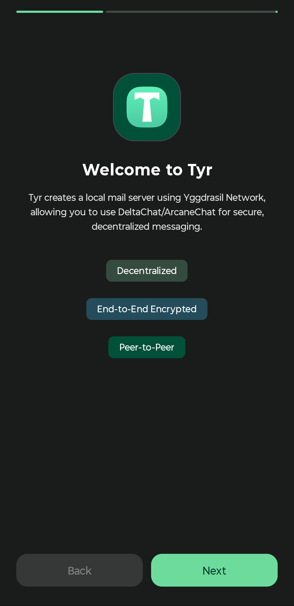
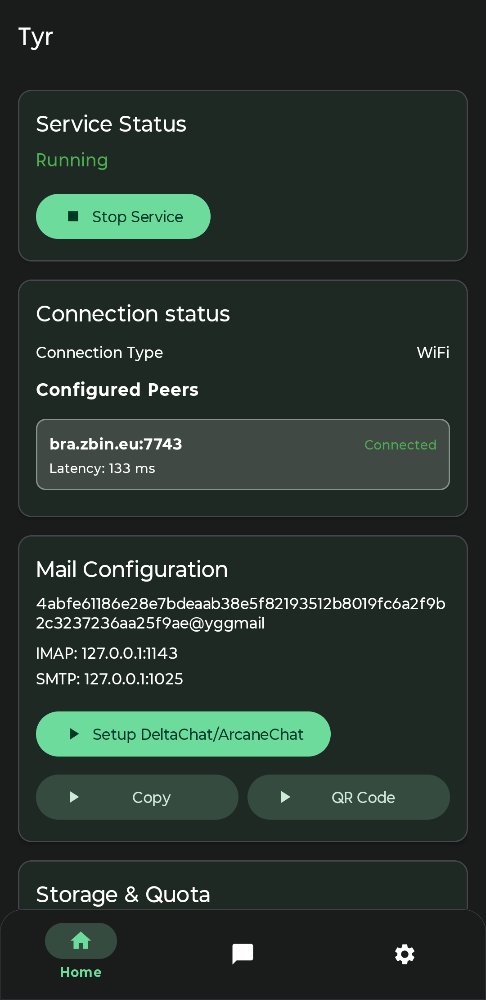
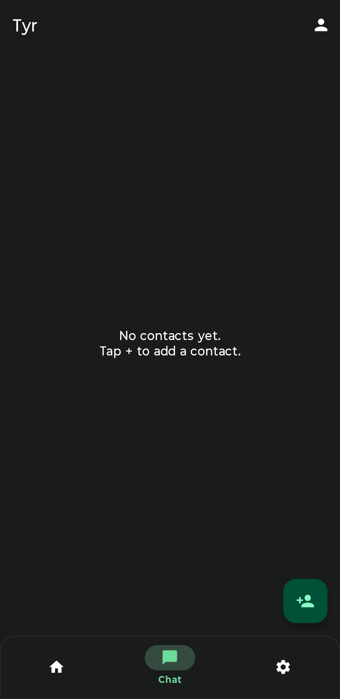
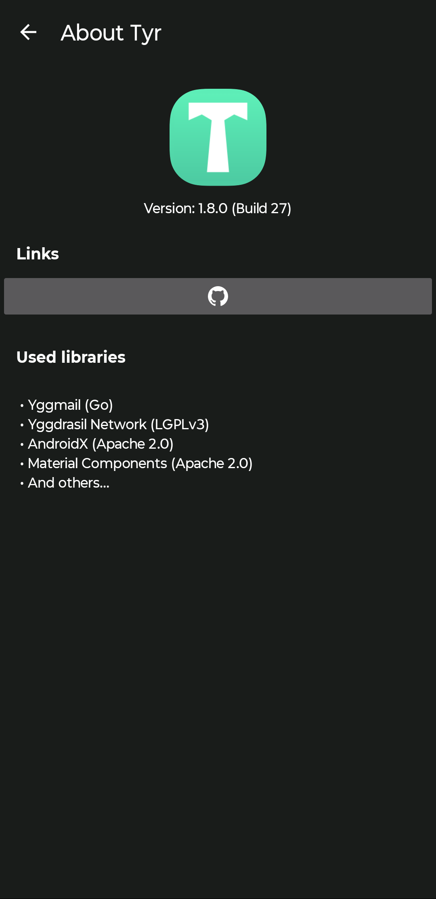
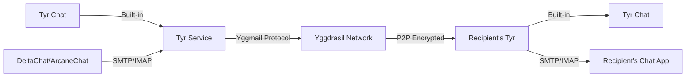

<div align="center">

# 📧 Tyr

True Peer-to-Peer Email on Yggdrasil Network

[](LICENSE)

[](https://kotlinlang.org)


[](https://github.com/JB-SelfCompany/Tyr)

[](https://apt.izzysoft.de/packages/com.jbselfcompany.tyr)

**[English](#) | [Русский](README.ru.md)**

</div>

---

## 📸 Screenshots

<div align="center">

| | | | |
| --- | --- | --- | --- |
|  |  |  |  |

</div>

---

## 🌐 What is Tyr?

We're taught that email must go through servers. Why? Because the Internet was built around centralized infrastructure. Every email you send travels through multiple servers - your provider's server, maybe a few relay servers, and finally your recipient's provider's server. Each hop is a potential point of surveillance, censorship, or failure.

Even "encrypted" email solutions still rely on these centralized servers. They encrypt the message content but the metadata - who you're talking to, when, how often - is visible to anyone watching the servers.

But there is a network, called **[Yggdrasil](https://yggdrasil-network.github.io/)**, that gives everyone a free IPv6 and doesn't need a blessing from your ISP. We finally have this possibility to use true P2P email. And moreover, this network has strong encryption to protect all data that flows from one IP to another.

**Tyr brings true peer-to-peer email to your Android device** using these unusual conditions. Unlike traditional email clients, Tyr doesn't need:

- ❌ Centralized mail servers (the connections are straight P2P)
- ❌ Message encryption layers (the network takes care of that)
- ❌ Port forwarding or STUN/TURN servers (Yggdrasil handles NAT traversal)

---

## ✨ Features

| Feature | Description |
|---------|-------------|
| 💬 **Built-in Tyr Chat** | Native P2P messenger — no third-party app needed. Send messages and photos directly over Yggdrasil |
| 🔗 **Full DeltaChat/ArcaneChat Integration** | Seamless setup with the best decentralized messengers |
| 📧 **Email Client Support** | Works with K-9 Mail, Thunderbird Mobile, FairEmail, and any SMTP/IMAP client |
| 📱 **QR Code Sharing** | Generate and share mailto: links via QR codes |
| 📧 **Local SMTP/IMAP Server** | Complete mail server running directly on your device |
| 🔐 **Cryptographic Identity** | Automatic Ed25519 key generation - your mail identity cannot be spoofed |
| 🌍 **Yggdrasil Network** | Connect via configurable peers - censorship-resistant by design |
| 🔍 **Auto-Peer Discovery** | Automatic peer discovery with RTT-based sorting for optimal performance |
| 🔔 **Push Notifications** | Instant message delivery with minimal battery impact |
| 🚀 **Auto-Start on Boot** | Always-on availability for incoming messages |
| 💾 **Encrypted Backup & Restore** | Password-protected configuration with optional key export |
| 🔋 **Extreme Battery Optimization** | 10-15x improvement: 1-3%/hour (was 15-30%), 98% fewer packets, full Doze Mode support |
| 📊 **Advanced Logging** | Period selection, log archiving, and real-time monitoring |

---

## 🛠️ How It Works



Tyr runs a complete email server right on your Android device, using the Yggdrasil network for transport. The **[Yggmail](https://github.com/JB-SelfCompany/yggmail-android)** mail server (built in Go) is embedded as a library inside the app and runs as a foreground service.

On top of Yggdrasil, it provides standard **SMTP** and **IMAP** protocols on localhost (`127.0.0.1:1025` and `127.0.0.1:1143`). Any email client can connect to these ports - but we recommend **DeltaChat** or **ArcaneChat** for the best P2P messaging experience.

### 💬 Built-in Tyr Chat

Starting with version 1.8, Tyr includes a **native P2P messenger** — no third-party app required. Open a contact's address, start chatting right away. The chat works directly over Yggdrasil using the same encrypted P2P transport.

**Chat features:**
- Send and receive text messages and photos
- Delivery status with checkmarks (sent / delivered)
- Tap any message to copy its text
- Auto-read: messages are marked as read the moment you open a conversation
- Notifications are suppressed while you are actively in the chat

### 📬 Mail Address Format

Every Tyr installation generates unique **Ed25519 cryptographic keys**. Your mail address is derived from your public key:

```
<64-hex-characters>@yggmail
```

This means your identity is **cryptographically verifiable** and cannot be spoofed.

---

## 📱 Quick Start

### Setting up DeltaChat/ArcaneChat

#### Option 1: Automatic Setup (Recommended)

1. Install Tyr and complete the onboarding (set password, configure peers)
2. Start the Yggmail service in Tyr
3. Install [DeltaChat](https://delta.chat/) or [ArcaneChat](https://github.com/ArcaneChat/android)
4. In Tyr's main screen, tap **"Setup DeltaChat/ArcaneChat"**
5. Tyr will automatically open your chat app with pre-configured settings
6. Complete the setup and start chatting!

#### Option 2: Manual Setup

If automatic setup doesn't work:

1. Complete Tyr onboarding and start the service
2. Copy your mail address from Tyr's main screen (looks like `abc123...@yggmail`)
3. In DeltaChat/ArcaneChat, create a new profile
4. Tap **"Use a different server"**
5. Enter your Yggmail address and the password you set in Tyr
6. Tap "✓" to complete setup

### Setting up Other Email Clients

Tyr works with any standard email client. For K-9 Mail, Thunderbird Mobile, or FairEmail:

1. Complete Tyr onboarding and start the service
2. In Tyr's main screen, tap **"Email Client Setup"** card for detailed instructions
3. Configure your email client with:
   - **Email**: Your mail address from Tyr (e.g., `abc123...@yggmail`)
   - **Password**: The password you set during Tyr onboarding
   - **IMAP**: 127.0.0.1:1143 (no encryption)
   - **SMTP**: 127.0.0.1:1025 (no encryption)

**QR Code Sharing**: Tap the **"QR Code"** button in Tyr to generate a QR code for your mail address. You can share it via the system share sheet to quickly exchange addresses with contacts.

> **Important**: Tyr must be running for your email client to send and receive messages. Enable auto-start in Tyr settings for seamless experience.

---

## 🔒 Security Features

- **Password Encryption**: Android Keystore System with AES-256-GCM
- **Automatic Keystore Recovery**: Handles Android Keystore issues on Samsung and other devices
- **Network Encryption**: All P2P communications encrypted by Yggdrasil Network
- **Local-Only Access**: SMTP/IMAP ports bound to localhost only
- **Cryptographic Identity**: Ed25519 keys ensure your mail address cannot be spoofed
- **Encrypted Backups**: Configuration and keys backed up with password protection
- **Privacy-First Push**: Instant notifications without third-party push services or metadata exposure

---

## 🏗️ Building from Source

### Prerequisites

- Android Studio (latest version)
- JDK 17
- Android SDK (API 23-36)
- Go 1.21+ and gomobile (only if rebuilding yggmail.aar)

### Build Commands

```bash
# Clone the repository
git clone https://github.com/JB-SelfCompany/Tyr.git
cd Tyr

# Build debug APK
./gradlew assembleDebug

# Install to connected device
./gradlew installDebug
```

APKs will be in `app/build/outputs/apk/debug/` or `app/build/outputs/apk/release/`

### Rebuilding yggmail.aar (optional)

```bash
cd ../yggmail/mobile

# Windows
..\build-android.bat

# Unix
gomobile bind -target=android -androidapi 23 -javapkg=com.jbselfcompany.tyr -ldflags="-checklinkname=0" -o yggmail.aar .
```

Then copy `yggmail.aar` to `Tyr/app/libs/`

---

## 🔧 Technical Details

| Component | Details |
|-----------|---------|
| **Language** | Kotlin 2.2.20 |
| **Min SDK** | 23 (Android 6.0) |
| **Target SDK** | 33 (Android 13) |
| **Compile SDK** | 36 |
| **Architecture** | Layered (UI → Service → Data) |
| **Mail Server** | Yggmail (Go library via gomobile) |
| **Network** | Yggdrasil overlay mesh network |
| **Localization** | English, Russian |
| **Native Library** | yggmail.aar (located in `app/libs/`) |

---

## 🤝 Related Projects

- **[Yggmail](https://github.com/JB-SelfCompany/yggmail-android)**: The mail transfer agent that powers Tyr
- **[Mimir](https://github.com/Revertron/Mimir)**: P2P messenger on Yggdrasil (sister project)
- **[Yggdrasil Network](https://yggdrasil-network.github.io/)**: The mesh network infrastructure
- **[DeltaChat](https://delta.chat/)**: Recommended email-based messenger client
- **[ArcaneChat](https://github.com/ArcaneChat/android)**: Alternative email-based messenger client
- **[K-9 Mail](https://k9mail.app/)**: Open-source email client for Android
- **[Thunderbird Mobile](https://www.thunderbird.net/mobile/)**: Mozilla's mobile email client (based on K-9)
- **[FairEmail](https://email.faircode.eu/)**: Privacy-oriented email client for Android

---

## 📄 License

Tyr is open source software. The Yggmail library uses **Mozilla Public License v. 2.0**.

See [LICENSE](LICENSE) file for full details.

---

## 🌟 Why P2P Email Matters

> **Censorship Circumvention**: Connect to any of hundreds of available Yggdrasil nodes, host your own, or even build a private network. Email freedom is literally in your hands.

> **Privacy by Design**: No metadata collection, no server logs, no third-party surveillance. Your conversations belong to you.

> **Decentralization**: No single point of failure, no corporate control. True peer-to-peer architecture.

---

<div align="center">

Made with ❤️ by <a href="https://github.com/JB-SelfCompany">JB-SelfCompany</a>

</div>
