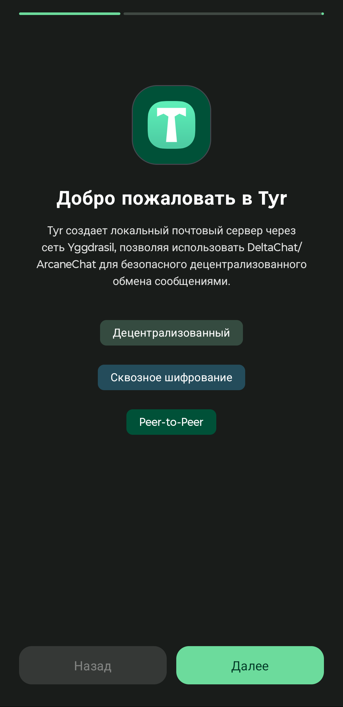
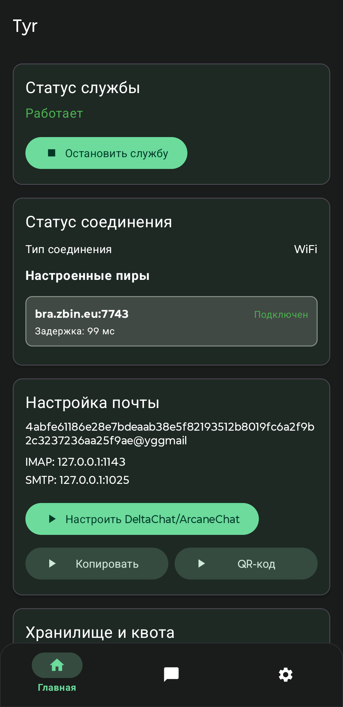
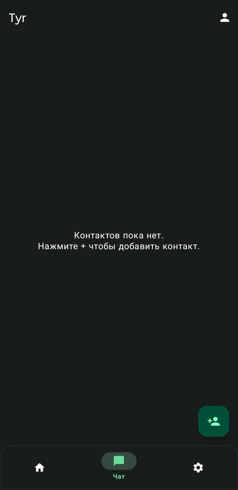
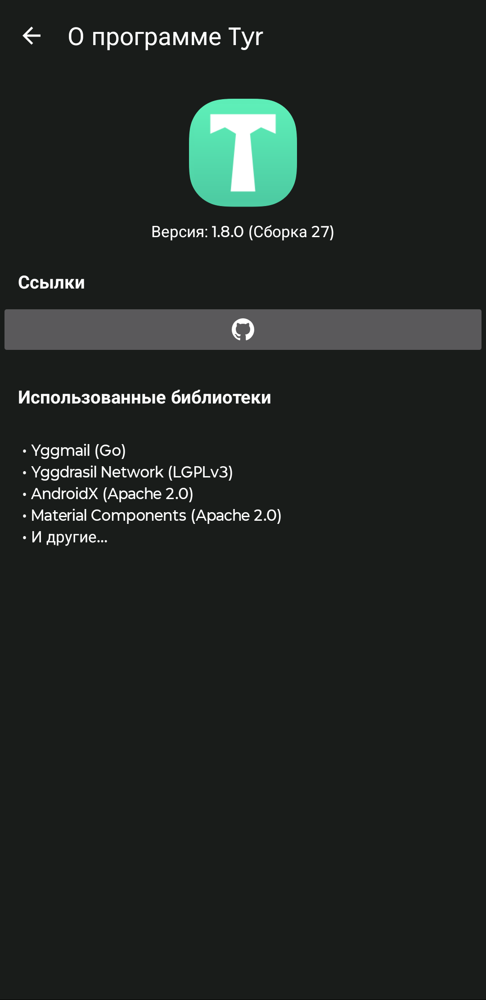
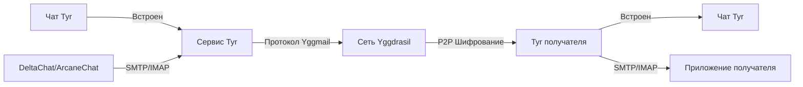

<div align="center">

# Tyr

### Настоящая P2P электронная почта поверх сети Yggdrasil

[](LICENSE)
[](https://www.android.com)
[](https://kotlinlang.org)


[](https://github.com/JB-SelfCompany/Tyr)

[](https://apt.izzysoft.de/packages/com.jbselfcompany.tyr)

**[English](README.md) | [Русский](#)**

</div>

## 📸 Скриншоты

<div align="center">

| | | | |
| --- | --- | --- | --- |
|  |  |  |  |

</div>

---

## 🌐 Что такое Tyr?

Нас учат, что электронная почта должна проходить через серверы. Почему? Потому что Интернет был построен на централизованной инфраструктуре. Каждое ваше письмо проходит через множество серверов - сервер вашего провайдера, возможно несколько промежуточных серверов, и наконец сервер провайдера получателя. Каждый промежуточный узел - это потенциальная точка слежки, цензуры или отказа.

Даже "зашифрованные" почтовые решения все еще зависят от этих централизованных серверов. Они шифруют содержимое сообщения, но метаданные - с кем вы общаетесь, когда, как часто - видны всем, кто наблюдает за серверами.

Но есть сеть под названием **[Yggdrasil](https://yggdrasil-network.github.io/)**, которая дает каждому бесплатный IPv6 и не требует разрешения от вашего интернет-провайдера. У нас наконец появилась возможность использовать настоящую P2P электронную почту. Более того, эта сеть имеет сильное шифрование для защиты всех данных, передаваемых от одного IP к другому.

**Tyr приносит настоящую одноранговую электронную почту на ваше Android-устройство**, используя эти необычные условия. В отличие от традиционных почтовых клиентов, Tyr не нуждается в:

- ❌ Централизованных почтовых серверах (соединения происходят напрямую P2P)
- ❌ Дополнительных уровнях шифрования сообщений (сеть сама заботится об этом)
- ❌ Проброске портов или STUN/TURN серверах (Yggdrasil справляется с NAT traversal)

---

## ✨ Возможности

| Функция | Описание |
|---------|----------|
| 💬 **Встроенный чат Tyr** | Нативный P2P-мессенджер без сторонних приложений. Отправляйте сообщения и фото прямо через Yggdrasil |
| 🔗 **Полная интеграция с DeltaChat/ArcaneChat** | Бесшовная настройка с лучшими децентрализованными мессенджерами |
| 📧 **Поддержка почтовых клиентов** | Работает с K-9 Mail, Thunderbird Mobile, FairEmail и любыми SMTP/IMAP клиентами |
| 📱 **Обмен через QR-коды** | Генерация и обмен mailto: ссылками через QR-коды |
| 📧 **Локальный SMTP/IMAP сервер** | Полноценный почтовый сервер прямо на вашем устройстве |
| 🔐 **Криптографическая идентичность** | Автоматическая генерация Ed25519 ключей - вашу личность невозможно подделать |
| 🌍 **Сеть Yggdrasil** | Подключение через настраиваемые пиры - защита от цензуры по дизайну |
| 🔍 **Автоматический поиск пиров** | Автоматическое обнаружение пиров с сортировкой по RTT для оптимальной производительности |
| 🔔 **Push-уведомления** | Мгновенная доставка сообщений с минимальным расходом батареи |
| 🚀 **Автозапуск при загрузке** | Постоянная доступность для входящих сообщений |
| 💾 **Зашифрованное резервное копирование** | Защищенная паролем конфигурация с опциональным экспортом ключей |
| 🔋 **Экстремальная оптимизация батареи** | Улучшение в 10-15 раз: 1-3%/час (было 15-30%), на 98% меньше пакетов, полная поддержка Doze Mode |
| 📊 **Расширенное логирование** | Выбор периода, архивирование логов и мониторинг в реальном времени |

---

## 🛠️ Как это работает



Tyr запускает полноценный почтовый сервер прямо на вашем Android-устройстве, используя сеть Yggdrasil для транспорта. Почтовый сервер **[Yggmail](https://github.com/JB-SelfCompany/yggmail-android)** (написанный на Go) встроен в приложение как библиотека и работает как foreground-сервис.

Поверх Yggdrasil он предоставляет стандартные протоколы **SMTP** и **IMAP** на localhost (`127.0.0.1:1025` и `127.0.0.1:1143`). Любой почтовый клиент может подключиться к этим портам - но мы рекомендуем **DeltaChat** или **ArcaneChat** для лучшего P2P-опыта обмена сообщениями.

### 💬 Встроенный чат Tyr

Начиная с версии 1.8, Tyr включает **нативный P2P-мессенджер** — никакие сторонние приложения не нужны. Укажите адрес контакта и сразу начинайте общаться. Чат работает напрямую через Yggdrasil с тем же зашифрованным P2P-транспортом.

**Возможности чата:**
- Отправка и получение текстовых сообщений и фото
- Статус доставки с галочками (отправлено / доставлено)
- Нажатие на сообщение — контекстное меню с копированием текста
- Автопрочтение: сообщения помечаются прочитанными сразу при открытии переписки
- Уведомления не приходят, пока вы находитесь в активном чате

### 📬 Формат почтового адреса

Каждая установка Tyr генерирует уникальные **криптографические ключи Ed25519**. Ваш почтовый адрес получается из вашего публичного ключа:

```
<64-шестнадцатеричных-символа>@yggmail
```

Это означает, что ваша личность **криптографически проверяема** и не может быть подделана.

---

## 📱 Быстрый старт

### Настройка DeltaChat/ArcaneChat

#### Вариант 1: Автоматическая настройка (Рекомендуется)

1. Установите Tyr и завершите онбординг (установите пароль, настройте пиры)
2. Запустите сервис Yggmail в Tyr
3. Установите [DeltaChat](https://delta.chat/) или [ArcaneChat](https://github.com/ArcaneChat/android)
4. На главном экране Tyr нажмите **"Настроить DeltaChat/ArcaneChat"**
5. Tyr автоматически откроет ваше приложение с предварительно настроенными параметрами
6. Завершите настройку и начинайте общаться!

#### Вариант 2: Ручная настройка

Если автоматическая настройка не работает:

1. Завершите онбординг Tyr и запустите сервис
2. Скопируйте ваш почтовый адрес с главного экрана Tyr (выглядит как `abc123...@yggmail`)
3. В DeltaChat/ArcaneChat создайте новый профиль
4. Нажмите **"Использовать другой сервер"**
5. Введите ваш Yggmail адрес и пароль, установленный в Tyr
6. Нажмите "✓" для завершения настройки

### Настройка других почтовых клиентов

Tyr работает с любым стандартным почтовым клиентом. Для K-9 Mail, Thunderbird Mobile или FairEmail:

1. Завершите онбординг Tyr и запустите сервис
2. На главном экране Tyr нажмите карточку **"Настройка почтовых клиентов"** для подробных инструкций
3. Настройте ваш почтовый клиент следующими параметрами:
   - **Email**: Ваш почтовый адрес из Tyr (напр., `abc123...@yggmail`)
   - **Пароль**: Пароль, установленный при онбординге Tyr
   - **IMAP**: 127.0.0.1:1143 (без шифрования)
   - **SMTP**: 127.0.0.1:1025 (без шифрования)

**Обмен через QR-код**: Нажмите кнопку **"QR-код"** в Tyr, чтобы сгенерировать QR-код для вашего почтового адреса. Вы можете поделиться им через системное меню обмена, чтобы быстро обмениваться адресами с контактами.

> **Важно**: Tyr должен быть запущен, чтобы ваше приложение могло отправлять и получать сообщения. Включите автозапуск в настройках Tyr для бесшовной работы.

---

## 🔒 Функции безопасности

- **Шифрование паролей**: Android Keystore System с AES-256-GCM
- **Автоматическое восстановление Keystore**: Обрабатывает проблемы с Android Keystore на устройствах Samsung и других
- **Сетевое шифрование**: Все P2P коммуникации зашифрованы сетью Yggdrasil
- **Только локальный доступ**: Порты SMTP/IMAP привязаны только к localhost
- **Криптографическая идентичность**: Ключи Ed25519 гарантируют, что ваш почтовый адрес невозможно подделать
- **Зашифрованные резервные копии**: Конфигурация и ключи сохраняются с защитой паролем
- **Push с приоритетом приватности**: Мгновенные уведомления без сторонних push-сервисов и раскрытия метаданных

---

## 🏗️ Сборка из исходников

### Требования

- Android Studio (последняя версия)
- JDK 17
- Android SDK (API 23-36)
- Go 1.21+ и gomobile (только если пересобираете yggmail.aar)

### Команды сборки

```bash
# Клонировать репозиторий
git clone https://github.com/JB-SelfCompany/Tyr.git
cd Tyr

# Собрать debug APK
./gradlew assembleDebug

# Установить на подключенное устройство
./gradlew installDebug
```

APK файлы будут в `app/build/outputs/apk/debug/` или `app/build/outputs/apk/release/`

### Пересборка yggmail.aar (опционально)

```bash
cd ../yggmail/mobile

# Windows
..\build-android.bat

# Unix
gomobile bind -target=android -androidapi 23 -javapkg=com.jbselfcompany.tyr -ldflags="-checklinkname=0" -o yggmail.aar .
```

Затем скопируйте `yggmail.aar` в `Tyr/app/libs/`

---

## 🔧 Технические детали

| Компонент | Детали |
|-----------|--------|
| **Язык программирования** | Kotlin 2.2.20 |
| **Min SDK** | 23 (Android 6.0) |
| **Target SDK** | 33 (Android 13) |
| **Compile SDK** | 36 |
| **Архитектура** | Слоистая (UI → Service → Data) |
| **Почтовый сервер** | Yggmail (библиотека на Go через gomobile) |
| **Сеть** | Оверлейная mesh-сеть Yggdrasil |
| **Локализация** | Английский, Русский |
| **Нативная библиотека** | yggmail.aar (находится в `app/libs/`) |

---

## 🤝 Связанные проекты

- **[Yggmail](https://github.com/JB-SelfCompany/yggmail-android)**: Агент передачи почты, на котором работает Tyr
- **[Mimir](https://github.com/Revertron/Mimir)**: P2P мессенджер на Yggdrasil (родственный проект)
- **[Yggdrasil Network](https://yggdrasil-network.github.io/)**: Инфраструктура mesh-сети
- **[DeltaChat](https://delta.chat/)**: Рекомендуемый клиент-мессенджер на основе email
- **[ArcaneChat](https://github.com/ArcaneChat/android)**: Альтернативный клиент-мессенджер на основе email
- **[K-9 Mail](https://k9mail.app/)**: Почтовый клиент с открытым исходным кодом для Android
- **[Thunderbird Mobile](https://www.thunderbird.net/mobile/)**: Мобильный почтовый клиент Mozilla (основан на K-9)
- **[FairEmail](https://email.faircode.eu/)**: Ориентированный на конфиденциальность почтовый клиент для Android

---

## 📄 Лицензия

Tyr - программное обеспечение с открытым исходным кодом. Библиотека Yggmail использует **Mozilla Public License v. 2.0**.

Подробности смотрите в файле [LICENSE](LICENSE).

---

## 🌟 Почему P2P почта важна

> **Обход цензуры**: Подключайтесь к любому из сотен доступных узлов Yggdrasil, размещайте свой собственный или даже стройте частную сеть. Свобода электронной почты буквально в ваших руках.

> **Конфиденциальность по дизайну**: Никакого сбора метаданных, никаких логов на серверах, никакой слежки третьих лиц. Ваши разговоры принадлежат вам.

> **Децентрализация**: Нет единой точки отказа, нет корпоративного контроля. Настоящая одноранговая архитектура.

---

<div align="center">

Made with ❤️ by <a href="https://github.com/JB-SelfCompany">JB-SelfCompany</a>

</div>
